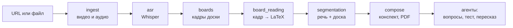

<div align="center">

# bropilot

**Видеолекция → конспект в LaTeX, вопросы по материалу и тест на понимание**

[](https://github.com/th3paypal/bropilot/actions/workflows/tests.yml)


</div>

<!-- Замените YOUR_LOGIN на свой логин GitHub (две строки выше).
     Скриншот: сохраните снимок вкладки «Конспект» как docs/screenshots/ui_notes.png -->
<p align="center"></p>

bropilot берёт запись лекции (ссылку на YouTube или файл) и делает из неё:

- **конспект** в LaTeX, PDF и Markdown с определениями, утверждениями и формулами — в том числе теми, что были только на доске;
- **ответы на вопросы** по лекции со ссылками на моменты записи;
- **тест** с выбором ответа, проверкой и переходом к нужному фрагменту;
- **пересказ** всей лекции или отдельной темы;
- **навигацию по времени**: каждая метка времени — и в конспекте на экране, и в
  собранном PDF, и в экспорте в Markdown — кликабельна. В интерфейсе она
  перематывает встроенный плеер, в PDF и Markdown открывает запись на нужной
  секунде;
- **учёт времени и денег**: сколько шла расшифровка и вся обработка, сколько
  потрачено токенов и во что это обошлось — с пересчётом на тарифы аналогов.

Рассчитан на записи экрана с графическим планшетом или слайдами (например,
лекции курса «Машинное обучение» ФКН ВШЭ). Работает на обычном ноутбуке без
видеокарты.

---

## Как это работает



| Стадия | Что делает |
|---|---|
| **ingest** | скачивает видео (yt-dlp) и извлекает звук 16 кГц |
| **asr** | распознаёт речь faster-whisper, отбрасывает тишину и «зацикливания» |
| **boards** | из кадра в секунду выбирает моменты, когда запись на доске закончена: сравнивает маски чернил *по направлению* — «дописали» или «стёрли» |
| **board_reading** | мультимодальная модель переводит кадр в LaTeX, подглядывая в речь за то же время |
| **segmentation** | делит лекцию на разделы по смене доски и провалам связности речи |
| **compose** | пишет разделы, проверяет LaTeX, собирает `notes.tex` и `notes.pdf` |

Каждая стадия кеширует результат: изменили порог зрения — речь заново не
распознаётся. Подробности алгоритмов — в [docs/METHOD.md](docs/METHOD.md).

---

## Быстрый старт

Нужен **Python 3.10+**. Для PDF — любой движок LaTeX; проще всего
[tectonic](https://tectonic-typesetting.github.io/) — это один самодостаточный
файл, который сам докачивает нужные пакеты:

```bash
brew install tectonic                          # macOS
winget install TectonicProject.Tectonic        # Windows
cargo install tectonic                         # Linux
```

Подойдут и `latexmk`, `xelatex`, `lualatex` из MiKTeX, MacTeX или
`texlive-xetex`. Без движка конспект доступен в LaTeX и Markdown, а PDF можно
собрать позже кнопкой «Собрать PDF» — повторный прогон и новые траты на API для
этого не нужны.

**Windows:** двойной клик по `run_app.bat`.
**macOS / Linux:**

```bash
./run_app.sh
```

При первом запуске создаётся окружение `.venv` и ставятся зависимости
(несколько минут), затем в браузере открывается интерфейс.

**Чтобы команда `bropilot` работала из любой папки**, поставьте её глобально —
тогда не нужно каждый раз заходить в проект и активировать окружение:

```bash
uv tool install --editable /путь/к/bropilot     # рекомендуется: `--editable`,
                                                # правки в коде подхватываются сразу
pipx install --editable /путь/к/bropilot        # или так, если нет uv
```

После этого из любой папки работает `bropilot serve`, `bropilot run …` и
остальные команды. Обновлять ничего не нужно: при editable-установке команда
использует код прямо из папки проекта.

**Ключ API.** Чтение доски, конспект, вопросы и тест используют
[Claude API](https://platform.claude.com/). Ключ вводится в боковой панели
интерфейса или задаётся переменной окружения:

```bash
export ANTHROPIC_API_KEY=sk-ant-...          # macOS / Linux
setx ANTHROPIC_API_KEY "sk-ant-..."          # Windows (затем откройте новое окно)
```

Распознавание речи и поиск кадров работают локально и ключа не требуют.

**Проверка установки** — без ключа, сети и видеокарты, около минуты:

```bash
python scripts/smoke_test.py --keep
```

В конце должно появиться `ВСЁ РАБОТАЕТ`, а в интерфейсе — «Синтетическая лекция».

<details>
<summary>Установка вручную</summary>

```bash
python -m venv .venv
source .venv/bin/activate          # Windows: .venv\Scripts\activate
pip install -e .
bropilot serve                     # поднимает localhost и открывает браузер
```

</details>

---

## Использование

### Веб-интерфейс

Сверху — полоса вкладок: **＋** для новой лекции, дальше уже обработанные.

| Вкладка | Что там |
|---|---|
| **＋** | ссылка, путь к файлу или загрузка; режим «только локальная часть» без API |
| Конспект | разделы с формулами, кликабельные метки времени, скачивание и сохранение в любую папку |
| Вопросы | пересказ лекции или темы и диалог по материалу со ссылками на время |
| Тест | генерация, ответы, проверка с объяснениями; начатый тест не теряется |
| Доска | найденные кадры и то, что на них прочитано |
| Речь | поиск по речи и доске без API, полная расшифровка |
| Стоимость | время расшифровки и обработки, токены, деньги, сравнение с аналогами |

Обработка идёт в отдельном процессе: вкладку можно закрыть, прогресс
сохранится. Пока прогон идёт, в панели виден текущий этап, время каждого
завершённого этапа и общее время с начала.

**Где лежат лекции** и **куда сохранять конспекты** — в боковой панели,
раздел «Хранилище». Смена папки не прячет уже обработанные лекции: прежние
хранилища остаются в списке. То же из командной строки:
`bropilot config --runs ~/lectures --export ~/Desktop`.

**Удалить лекцию** — «Управление» в заголовке лекции (или `bropilot remove <источник>`).
Удаляется вся папка прогона: видео, кадры, кеш, конспект.

Состояние страницы живёт в адресной строке (`?lecture=…&tab=…&t=…`), поэтому
ссылку на конкретный момент конкретной лекции можно просто переслать.

**Лекцию для демонстрации лучше обработать заранее** — готовые результаты
открываются мгновенно.

### Командная строка

```bash
bropilot serve                                                 # веб-интерфейс на localhost
bropilot serve --port 8600 --background                        # фоном; остановить: --stop
bropilot run "https://www.youtube.com/watch?v=..."             # полный проход
bropilot --config cpu run lecture.mp4 asr.model=medium         # без видеокарты
bropilot run lecture.mp4 --until boards                        # только локальные стадии
bropilot run lecture.mp4 vision.tau_erase=0.02 --force         # другой порог, пересчёт
bropilot inspect lecture.mp4 --transcript
bropilot ask  lecture.mp4 "чем Adam отличается от RMSProp?"
bropilot quiz lecture.mp4 -n 12 --answers
bropilot pdf  lecture.mp4 -o ~/Desktop/конспект.pdf            # пересобрать PDF без API
bropilot cost lecture.mp4                                      # время, токены, деньги
bropilot library                                               # что уже обработано
bropilot remove lecture.mp4                                    # удалить лекцию
bropilot config --runs ~/lectures                              # где хранить лекции
```

Параметры вида `ключ=значение` пишутся как обычные аргументы, флаги — в любом
месте. Результаты лежат в `<хранилище>/<хеш источника>/`: `frames/`, `cache/`,
`output/notes.tex`, `output/notes.pdf`, `lecture.json`.

---

## Конфигурация

Все параметры — в `configs/` (YAML), любой можно переопределить из командной
строки.

| Параметр | По умолчанию | Смысл |
|---|---|---|
| `asr.model` | `large-v3` (GPU) / `small` (профиль `cpu`) | размер Whisper |
| `vision.tau_erase` | `0.010` | доля исчезнувших чернил, означающая «доску стёрли» |
| `vision.tau_jump` | `0.060` | доля появившихся разом чернил — «новый слайд» |
| `segmentation.w_visual` / `w_lexical` | `0.6` / `0.4` | вклад доски и речи в границы разделов |
| `llm.text_model`, `llm.vision_model` | `claude-sonnet-5` | модель |
| `llm.concurrency` | `4` | параллельные запросы |

---

## Структура проекта

```
bropilot/
├── app.py                  веб-интерфейс (Streamlit)
├── run_app.bat / run_app.sh
├── configs/                параметры: asr, vision, llm, compose
├── templates/              шаблон документа и запросов к модели
├── src/bropilot/
│   ├── stages/             шесть стадий пайплайна
│   ├── agents/             поиск, вопросы, тест, пересказ
│   ├── utils/              изображения, клиент модели, LaTeX, Markdown
│   ├── pipeline.py         сборка и запуск стадий
│   ├── jobs.py             фоновые прогоны для интерфейса
│   ├── exporting.py        сборка PDF и сохранение конспекта куда угодно
│   ├── pricing.py          токены и время → деньги, тарифы аналогов
│   ├── settings.py         пользовательские настройки (папки, профиль, модель)
│   ├── schema.py           модель данных (lecture.json)
│   └── evaluation.py       метрики против эталонного конспекта
├── scripts/                smoke_test, benchmark, cost_report, evaluate, calibrate_vision
├── tests/                  99 тестов без видео, сети и API
└── docs/                   описание метода
```

---

## Тесты и эксперименты

```bash
pytest -q                          # 99 тестов, ~3 секунды
python scripts/smoke_test.py       # сквозной прогон на синтетической лекции
python scripts/benchmark.py        # время и память локальных стадий → bench_results/
python scripts/cost_report.py --latex   # время, токены, деньги и тарифы аналогов
python scripts/evaluate.py runs/<hash>/output/notes.tex --reference lecture03.tex
```

Отбор кадров работает примерно за 12 мс на кадр на одном ядре
(≈1 минута на 80-минутную лекцию) и занимает ≈0.3 ГБ памяти.

Замеры на записи 20 минут (ноутбук без видеокарты, Whisper small,
Claude Sonnet 5): обработка целиком — 3 мин 45 с, из них расшифровка речи
2 мин 46 с; это в 5.4 раза быстрее реального времени. Расход — 5 вызовов к
API, 10.7 тыс. входных и 5.2 тыс. выходных токенов, **$0.11 за лекцию**
(≈$0.33 за час записи). Полные таблицы, включая пересчёт на тарифы
NotebookLM, Otter.ai и Mathpix, — `python scripts/cost_report.py`;
прайсы со ссылками на источники и датами проверки — `configs/pricing.yaml`.

---

## Ограничения

- Прокрутка холста планшета пока принимается за стирание — часть кадров доски дублируется.
- Цены аналогов в `configs/pricing.yaml` проверены вручную и устаревают: перед
  сдачей отчёта их стоит сверить с сайтами сервисов.
- Рисунки и графики в конспект не переносятся: на их месте пометка с описанием.
- Пороги зрения подобраны для записей экрана; для съёмки доски камерой их нужно калибровать.
- Для конспекта и агентов нужен доступ к API.

---

## Документация

- [docs/METHOD.md](docs/METHOD.md) — алгоритмы, метрики, параметры